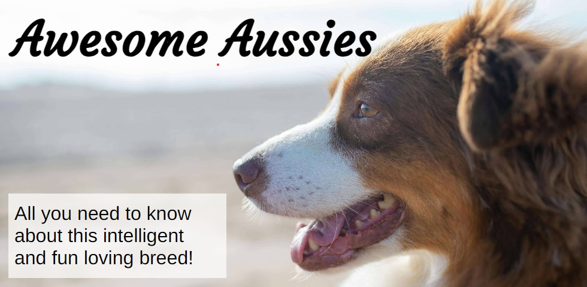

# Awesome Aussies

Awesome Aussies is a websites that targets an audience that is thinking about adding a new family member, and are looking for some general knowledge about this particular breed – to be able to decide if this is the dog for them! It´s purpose is not to encourage to buy the dog, but to provide some help in making that decision and is supposed to function as a place of knowledge. It doens’t target the user who alreday own this type of dog but acts as a support for the newbies. Hopefully it will provide the understanding of whether this is the dog for them – or absolutely not the dog for them. 

## Features

### Existing Features

__Navigation Bar__

+ The navigation bar is featured on all three pages of the websites and includes links to all the different pages. It helps the user find its way to the Home page/landing page, the About Page and a Contact page for further questions. 

+ The navigation bar is responsive and allows the user to jump between pages without having to use the ”back”-button. Furthermore the navigation bar has a drop down function for mobile devices so that it doesn’t take up to much space on smaller devices. On larger devices such as tablets and laptops it is responsive and changes size according to screen size. 

+ I decided to name it ”menu” in the drop down version on smaller devices, basically because of the fact that everybody is familiar with the term and what they use a menu for.

+ The background color for the navigation bar is picked from the header image so that they harmonize with each other. 

__The page header__

+ The landing page (featured on all pages) includes a header with a image of an Australian Shepherd, to quickly give the user a feeling of what the site is all about. The header also includes the name/title of the webpage and a text overlay that sums up the content so that the visitor can quickly deside if it’s worth to continue scrolling.
The chosen header-images also set the color-scheme for the rest of the page, to keep the layout consistent and harmonizing throughout the different features on the webpage.

__Content of the landing page__

+ Below the header and navigation menu (which is discussed in the sections above) the user will find some additional general information about the page and it’s content – with the purpose of making it even clearer to the user that this is the page they were looking for. They will se the benefits of continuing reading and what they will gain when looking at the other content of the page. Hopefully this part will also make it crystal clear to the visitor that the page is for the user thinking about getting the breed, not for the user that already owns the dog 
Also to validate the people behind the page 

Links to kennels 
Below the text content and another image are some links to different validated kennels if the user is interested in learning more about the buying-process itself and have come a little further in their descission-making. If the time weren’t as limited I think it would have been good to create a entire new page about this in the menu to the user to chose from, but that would have made the project a little to big for the time at hand since it requres a lot of research and collecting info and data from a lot of external sources. 

For this page the index.html file implements the content with additional styling found in the style.css file deployed through the assets-folder. 

__The Footer__

+ The footer section includes links to different social media platforms - relevant to the content of the website. They open in a new tab to allow for easy navigation and so that the user can easily finds it’s way back to the webpage without having to use the ”back” tab.
+ If the site were to be deployed and managed for a long period of time – the footer with it’s social media icons would lead the user to different forums and member pages on Facebook with the concept of ”Awesome Aussies” in mind – a place for the user to connect with likeminded and a place to ask all questions concerning their dogs. 

Again the same color used as in the navigation menu and other features on the page

__About the breed Page__

This page is probably the most valuable page to the user, since it contains

The content of the about-page comes from the 

__Contact Page__

Since the site can only hold some general information, the Contact Page is a chance for the user to ask other more specific questions they have about the breed that they didn’t find an answer to. The will be asked to provide their full name and e-mail adress so that the people behind the webpage will know whom and where to send the reply. 
It also features a larger area for the question or questions – which is made up of additional rows to provide the user with the possibility to write some more content than what a single lie provides them with. 
The Contact-form is responsive to all devices and the text changes size according to device to provide a better user experience. All input-text is required for the user to put in so 

This page gets its content from the contact.html file, and its looks and features from style.css. 

### Features left to Implement

Possible additional pages 
For this website to be of actual use to a user that is about to purschase a new dog, a page filled with links to different types of kennels would be a good idea som that the user can navigate further once the current webpage has filled it’s purpose. 
Another useful feature would have been to 

## Testing

## Validator testing

+ HTML
+ CSS
+ Accessibility using Lighthouse

## Unfixed bugs

From what I know there are no unfixed bugs, but the flex-box features were the biggest challenge for the project. Also finding the right margins and size of the content for different devices to make the user experience comfortable proved to be the biggest challenge in this particular project – mainly because the feature consists of only texts and images. Some more interactive features with videos and maybe a quiz-section would have added some more value to the user, but the main focus of the page is to show that the basic structure and features of HTML and CSS have been implemented.

## Deployment

The link to the live project-site can be found here:

## Credits

### Content
+ The text for the different sections on the About the breed page were taken form Wikipedia (länk) and [The farmers dog](https://www.thefarmersdog.com/digest/australian-shepherd-care-guide/) since the project is about the form and function, and not so much about the actual content of the paragraphs. 
+ The drop down menu for mobile devices was created with some code from the Love Running code along-project, altered to fit this pages layout. 
+ The Favicon was created with the help of [favicon.io](https://favicon.io/logo-generator/)
+ All the social media icons in the footer were taken from [Font Awesome](https://fontawesome.com/)
+ To pick the color scheme for the page I used [Image Color Picker](https://imagecolorpicker.com/en) on the header image. 
+ The [Stack Overflow](https://stackoverflow.com/) forums has been my go-to whenever it got stuck with mainly CSS and needed to find my way out. 

### Media
+ All the pictures used in the project – the header image, the image used in the content on the landing page and the images in the About the breed-section were all taken from the Open Source page [Pexels](https://www.pexels.com/sv-se/). 
+ All of the images were run through [Tinypng](https://tinypng.com/) to make them “lighter” and adapted for display on the web – so that the page doesn’t take to long to load because of heavy image files. 
+ Some of the images used were cropped with the help of Photoshop Express. 

Imperative mood missed in commit messages for the first part of the porject, lost in translation to swedish so didn’t understand that until halfway through the project

