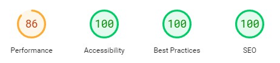

# Awesome Aussies

Awesome Aussies is a website targeting an audience that's thinking about adding a new family member in form of a dog - and are looking for some general knowledge about this particular breed to figure out if it's the right breed for them. The websites purpose is not to encourage anybody to buy the dog, but to provide some help in making the decision and is supposed to simply function as a place of knowledge. It doesn’t target the user who already own this type of dog, but acts as a support for the curious potential owner. Hopefully it will provide some understanding to whether this is the dog for them – or absolutely not the dog for them. 

## Features

### Existing Features

__The page header__

+ Every page on the site includes a header with a image of an Australian Shepherd, to quickly give the user a feeling of what the site is all about. The header also includes the name/title of the webpage and a text overlay that sums up the content, so that the visitor can quickly decide if it’s worth to continue scrolling.

+ The chosen header-image sets the colour-scheme for the rest of the page, to keep the layout consistent and harmonizing throughout the different features on the webpage.

+ The headline in the header is linked to the Home page since a lot of users are used to this function from different pages on the web. 

__Navigation Bar__

+ The navigation bar is featured on all three pages of the website and include links to all the different pages. It helps the user find its way to the Home page/landing page, the About Page and a Contact page for further questions. 

+ The navigation bar is responsive and allows the user to jump between pages without having to use the ”back”-tab. Furthermore, the navigation bar has a drop down function for mobile devices so that it doesn’t take up to much space on smaller devices. On larger devices such as tablets and laptops it is responsive and changes font size according to screen size. 

+ I decided to simply name the navigation bar ”menu” in the drop down version on smaller devices, basically because everybody is familiar with the term and the purpose of a menu.

+ The background colour for the navigation bar is picked from the header image so that they harmonize with each other. 

+ The current page that the user is viewing is underlined in the navigation bar to further simplify navigation on the site for the user.

__Content of the home/landing page__

+ Below the header and navigation menu the user will find some additional general information about the page and its content – with the purpose of making it even clearer to the user that this is the page they were looking for. They will see the benefits of continuing to read, and what they will gain when looking at the other content of the page. Hopefully this information will also make it crystal clear to the visitor that the page is for the user thinking about getting the breed, not for the user that already owns the dog.

+ The content on the landing page also validates the people behind the page, so that the user will get a sense of that the creator knows what he/she is talking about. 

+ Below the text on the landing page is another image of an Australian Shepherd - mainly to have a visual element that breaks up the text and hopefully evokes a good feeling within the user. 

__Links to kennels__ 

+ Below the text and image on the home page are some links to different kennels, if the user is interested in learning more about the buying process itself and have come a little further in their decision making. 

+ In the short section of text there is also an embedded link to the Contact page if the user is interested in tips on more kennels.

+ All the external links open up in a new tab so that the user still has easy access to the original webpage.

+ The links have the same colour and font as other elements on the page and lives in a responsive flexbox to adjust from row to column depending on device.

For the entire home page the index.html file implements the content, with additional styling found in the style.css file deployed through the assets-folder. 

__The Footer__

+ The footer section includes links to different social media platforms - relevant to the content of the website. They open in a new tab to allow for easy navigation so that the user can easily finds its way back to the webpage without having to use the ”back” tab.

+ If the site was to be deployed "for real" and managed for a long period of time – the footer with its social media icons would lead the user to different forums and member pages on Facebook, Instagram and so on with the concept of ”Awesome Aussies” in mind – a place for the user to connect with like-minded and a place to ask other owners all questions concerning their dogs. But for now, the social media links direct the user to the official social media sites.

+ Again the same colour as in the navigation menu and other features on the page is used. 

__About the breed Page__

+ This page is probably the most valuable page to the user since it contains all the useful information about the breed. 

+ The content of the about-page comes from other pages on the web (see content credits further down), since the function and purpose rather than the actual content of the text is in focus for this assignment. 

+ Evry paragraph has a picture below it so that the user can rest their eyes before jumping on to the next section of text. The images are responsive in size to adjust according to screen size. 

+ This page gets its content from the about.html file, with additional styling form style.css. All images are found in the image folder. 

__Contact Page__

+ Since the site only holds some general information, the Contact Page is a chance for the user to ask other more specific questions about the breed that they didn’t find an answer to on the webpage. 

+ They will be asked to provide their full name, e-mail address and fill in the question-input to be able to press the "Send"-button. 

+ It features a larger input-area for the questions – which is made up of additional rows to provide the user with the possibility to write more content than single line provides them with. 

+ The Contact-form is responsive to all devices and the text changes size according to device to provide a better user experience. 

+ All input-text is required for the user to put in to verify that they are actual human beings. 

+ This page gets its content from the contact.html file, and its looks and features from style.css. 

### Features left to Implement

+ For this website to be of actual use to a user that is about to purchase a new dog, a page filled with links to different types of kennels would be a good idea so that the user can navigate further once the webpage has filled its purpose. But that would require a lot of research and collecting data from many of external sources. 

+ Another useful feature would have been to add more pages that splits up the about the breed content in the navigation bar itself - for example if you're only interested in how to train this particular breed you could find your way to that content right away in the navigation bar without having to scroll through other sections of text. 

+ A quiz about the breed would have been a nice feature to help the user on the way towards finding out if the Aussie is the right breed for them. 

+ Some instructional videos on how to train the dog would have been the perfect feature on a dedicated "Training"-page. 

## Testing

+ The page has been tested on different devices - such as phones, tablets and laptops. Among others the page has been tested on Samsung S22, Iphone 11, Apple Ipad, Goolge Chromebook and a wide screen desktop. 

+ When it comes to phones it has been viewed on five different models to make sure it looks the same depending on the brand and screen size of the phone.

+ It has been tested in different web browsers such as Google Chrome, Microsoft Edge, Safari and Mozilla Firefox to make sure everything acts as it should.

+ The internal links have been tested on both laptop and different mobile devices and works as they should, from all different pages.

+ The external links works as well, both the social media ones and the ones to different kennels. They all open in a new browser window as indented. 

+ The contact form is responsive and the required part on every row of input works. The autocomplete function also works as i should. When pressing "Send" the form returns information that the form has been prepared and submitted correctly. 

+ Responsivness has been tested on devices as small as 280px in screen size up to 2560px, with the help of Chrome DevTools. Through discussion with my mentor it was desided to keep the page responsive up to a screens size of 1200px, and make it "static" on wider screens so that the content wouldn't look weird and stretched. 

+ No elements overlap when viewed on smaller screens. Some features such as the external links to kennels acts differently depending on screens size - when viewed on smaller devices they appear in a vertical row, on larger devices they instead show up in a horizontal row.

+ Overall, the layout and functions are easy to access and the page has a clean and simple layout which enables easy access to all parts of the site for the user. 

## Validator testing

+ HTML - no errors was returned when the page was tested through the official [W3C validator](https://validator.w3.org/).

+ CSS - one error was returned when tested through the official [Jigsaw validator](https://jigsaw.w3.org/css-validator/), and that was a curly bracket missing. Tricky to spot when in the middle of coding, but easy to fix. 

+ When testing the accessibility using [Lighthouse for Chrome](https://chromewebstore.google.com/detail/blipmdconlkpinefehnmjammfjpmpbjk?hl=sv), everything came back at 100% accept for the Performance which at first came in at a lousy 70%. This was due to the image sizes on mainly the header image and the image on the home page which were waaay to big for pretty much every screen size. This was fixed with resizing both images and replacing the old ones in the image folder. After resizing both images the Performance came in at a much more pleasing number, but still not 100% which will be discussed in the Unfixed bugs-section below. Both the Home page and About page landed on 86%, while the Contact page came in at 91% in Perfomance.

1[printscreen lighthouse test](assets/images_readme/lighthouse_contact_page.jpg)

## Unfixed bugs

+ From what I know there are no unfixed bugs, but the flex-box features were the biggest challenge for the project. Also finding the right margins and size of the content for different devices to make the user experience comfortable proved to be the biggest challenge in this project – mainly because the content on the page consists of only texts and images. Some more interactive features with videos and maybe a quiz-section would have added more value to the user, but the focus of the page is to show that the basic structure and features of HTML and CSS have been implemented.

+ When testing the accessibility and genereal performance with the help of Lighthouse, the biggest issue that came up was concerning the Perfomance of the site. The Perfomance-number could have came in even better if the images had been converted to one of the new generation formats such as webp - to further reduce the image size and speed up the loading of the page. Another thing to address to speed up the loading would have been to implement a efficient cache policy for the site. 

## Deployment

The website was deployed using a hosting platform in the form of GitHub. The steps to deploy are as follows:
1. In the GitHub repository of the project, navigate to the "Settings"-tab
2. Select "Pages" in the left-hand menu and in the "Source" drop-down menu select "Deploy from a branch"
3. In the "Branch" section below chose the main branch
4. When the main branch is selected the GitHub repository will automatically refresh and after a little while you will find the Deployed page on the right-hand side with a detailed list of every updated deployment going forward. 

The link to the live project-site can be found here: https://sofiawallq.github.io/awesome_aussies/

## Credits

### Content
+ The text for the different sections on the About the breed page were taken from [Wikipedia](https://en.wikipedia.org/wiki/Australian_Shepherd) and [The farmers dog](https://www.thefarmersdog.com/digest/australian-shepherd-care-guide/) since the project is about the form and function, and not so much about the actual content of the paragraphs. 
+ The drop down menu for mobile devices was created with some code from the Love Running code along-project, altered to fit this pages layout. 
+ The Favicon was created with the help of [favicon.io](https://favicon.io/logo-generator/)
+ All the social media icons in the footer were taken from [Font Awesome](https://fontawesome.com/)
+ To pick the color scheme for the page I used [Image Color Picker](https://imagecolorpicker.com/en) on the header image. 
+ The [Stack Overflow](https://stackoverflow.com/) forums has been my go-to whenever it got stuck with mainly CSS and needed to find my way out. 

### Media
+ All the pictures used in the project – the header image, the image used in the content on the landing page and the images in the About the breed-section were all taken from the Open-Source page [Pexels](https://www.pexels.com/sv-se/). 
+ All the images were run through [Tinypng](https://tinypng.com/) to make them “lighter” and adapted for display on the web – so that the page doesn’t take to long to load because of heavy image files. 
+ Some of the images used were cropped with the help of Photoshop Express. 
